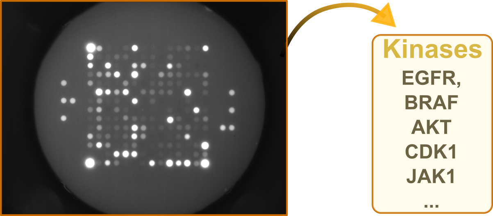

<br clear="right">

# pyKinaXe

pyKinaXe is a one-click solution for the fully automatic fast analysis of raw phosphopeptide-microarray data measured via PamGene technology
(https://pamdx.com). 

Its frontend user-friendly interface is accessible at https://pykinaxe.github.io/home.

Features:

- quantification of per-spot fluorescence intensities
- sample-level peptide statistics
- upstream kinase activity estimates
- pathway enrichment summaries
- publication and QC plots
- frontend interface with downloadable results

The repository contains both a terminal pipeline and a Flask-based web backend.
The core engine of pyKinaXe lives in `src/`, most user-adjustable defaults live in
`config/`, and the web runtime lives in `webapp/`.

## More information

More information on pyKinaXe is provided in the paper:

Wuttke D, Hildt E, Kolesnichenko PV. *pyKinaXe: a fast and robust turnkey kinase activity profiler with high resolution*. bioRxiv 2026.05.12.724658. [https://doi.org/10.64898/2026.05.12.724658](https://doi.org/10.64898/2026.05.12.724658)

## Validation Dataset

Validation data for this project is available here:

[https://doi.org/10.17632/ynp7f92n47.1](https://doi.org/10.17632/ynp7f92n47.1)

If you use the dataset, please cite:

Thiyagarajah K, Glitscher M, Hildt E. *Raw kinome array data - Differential impact of hepatitis delta virus replication and expression of viral antigens on the cellular kinome profile*. Mendeley Data, V1. [https://doi.org/10.17632/ynp7f92n47.1](https://doi.org/10.17632/ynp7f92n47.1)

## What pyKinaXe Does

At a high level, pyKinaXe

1. discovers or loads one PTK run and one STK run folder
2. imports TIFF images, array layout, and sample annotation metadata from these folders
3. converts sample annotations into an experimental design table
4. detects chip geometry and processes every image
5. computes per-spot intensities and exports chip-level tables
6. runs peptide statistics, upstream kinase analysis, and pathway enrichment
7. saves Excel outputs, heatmaps, volcano plots, Venn diagrams, and optional QC figures

The main terminal entry point is:

```bash
python scripts/kx_kinase_extraction_pipeline.py
```

The main local web-app entry point is:

```bash
python webapp/pykinaxe_webapp.py
```

## Repository Layout

```text
config/   configurations, default settings, runtime flags
data/     input data, external resources, processed peptide-kinase mapping tables
docs/     architecture, installation, and method notes
scripts/  human-facing command-line entry points
src/      core engine of pyKinaXe
tests/    validation and comparison scripts / notebooks
webapp/   Flask backend plus static frontend assets
```

## Installation

Python `3.11+` is required.

### Option 1: Conda Environment From `environment.yml` (Recommended)

This is the most convenient option for most users:

```bash
conda env create -f environment.yml
conda activate pykinaxe
```

Why this is recommended:

- `environment.yml` installs `inmoose` from Bioconda instead of building it locally from PyPI source.
- that route can avoid local C++ dependency issues on machines where `pip install inmoose` would otherwise fail
- it is the easiest path if you want the terminal pipeline and the web app in one environment

Important note:

- the Conda route may resolve a Bioconda build that lags behind the newest PyPI release slightly, because Conda channels and PyPI are published independently

### Option 2: Pip Install From `requirements.txt`

If you already have a working scientific Python environment and C++ build tools installed, you can install directly with pip:

```bash
python -m venv .venv
source .venv/bin/activate
pip install --upgrade pip
pip install -r requirements.txt
```

Potential issue with this route:

- PyPI currently distributes `inmoose` as a source distribution, so pip may need to build native code locally
- if your machine does not already have suitable C++ build tools, installation can fail during the `inmoose` step

If that happens, install a working native build toolchain first and then rerun
pip. Typical examples are:

- macOS: Xcode Command Line Tools (https://developer.apple.com/xcode/) / Clang  (https://clang.llvm.org)
- Linux: GCC/G++ and Python build headers (https://gcc.gnu.org)
- Windows: Visual Studio Build Tools (https://visualstudio.microsoft.com/visual-cpp-build-tools/)

If you do not want to manage that manually, prefer the Conda route above.

### Option 3: Editable Install From `pyproject.toml`

For development work on the Python package itself:

```bash
python -m venv .venv
source .venv/bin/activate
pip install --upgrade pip
pip install -e .
```

This installs the core scientific pipeline in editable mode.

### Option 4: Editable Install With Web Extras

If you also want the Flask web backend and Gunicorn locally:

```bash
python -m venv .venv
source .venv/bin/activate
pip install --upgrade pip
pip install -e .[web]
```

If `inmoose` fails during this route, the same compiler warning from the pip
section applies.

### Installation References

For more detail, see:

- [docs/installation.md](docs/installation.md)

## Running The Pipeline

### Terminal Workflow

Run the standard interactive pipeline:

```bash
python scripts/kx_kinase_extraction_pipeline.py
```

## Documentation Map

- [docs/installation.md](docs/installation.md): installation choices, troubleshooting, and environment notes
- [docs/codebase_guide.md](docs/codebase_guide.md): architecture, module responsibilities, data flow, and results layout
- [docs/uka_kpea_method.md](docs/uka_kpea_method.md): current UKA/KPEA method note

## Main Python Modules

- [scripts/kx_kinase_extraction_pipeline.py](scripts/kx_kinase_extraction_pipeline.py): human-facing terminal entry point
- [src/kx_pipeline_tools.py](src/kx_pipeline_tools.py): reusable orchestration helpers for terminal and web workflows
- [src/kx_data_importer.py](src/kx_data_importer.py): PTK/STK run discovery, TIFF import, metadata parsing, array layout loading
- [src/kx_data_enricher.py](src/kx_data_enricher.py): sample-annotation enrichment and several data-collection utilities
- [src/kx_image_processor.py](src/kx_image_processor.py): mask detection, reference-spot detection, grid localization, intensity extraction, QC plots
- [src/kx_peptide_analysis.py](src/kx_peptide_analysis.py): peptide-level statistics and heatmaps / volcano plots
- [src/kx_upstream_kinase_analysis.py](src/kx_upstream_kinase_analysis.py): kinase mapping, permutation scoring, UKA/KPEA outputs
- [src/kx_pathway_enrichment_analysis.py](src/kx_pathway_enrichment_analysis.py): g:Profiler-based pathway enrichment
- [src/kx_plot_results.py](src/kx_plot_results.py): reusable plotting classes
- [webapp/pykinaxe_webapp.py](webapp/pykinaxe_webapp.py): Flask API, upload handling, persistent queue, runtime lifecycle
- [webapp/backend/kx_web_kinase_extraction_pipeline.py](webapp/backend/kx_web_kinase_extraction_pipeline.py): non-interactive web-pipeline execution

## Results

The pipeline writes outputs under `results/` by default, unless overridden by
environment or web runtime settings. The exact layout depends on whether the
run is launched from the terminal pipeline or the web app, but in both cases.

The web app automatically downloads the results to user's default Downloads folder.

## License

See [LICENSE](LICENSE).
